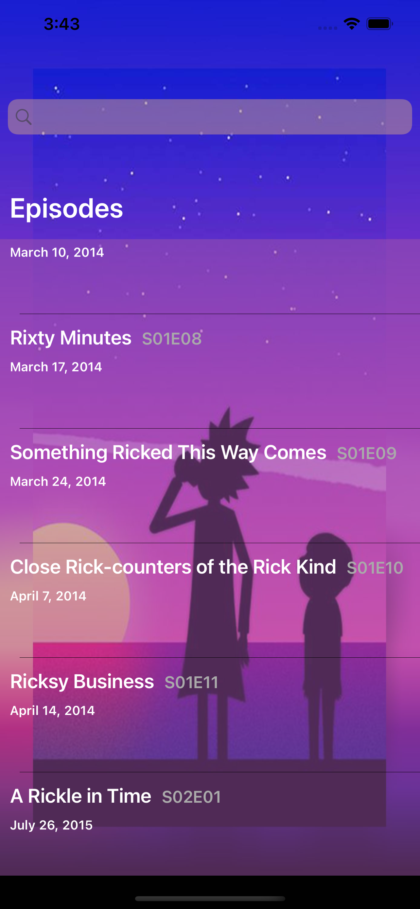
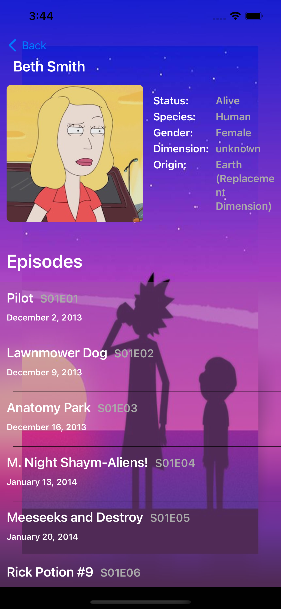

<h3 align="center">Rick and Morty</h3>

  

    A simple episode browsing app
  

<!-- ABOUT THE PROJECT -->
## About The Project

    

This app is created using  free API [https://rickandmortyapi.com/documentation](https://rickandmortyapi.com/documentation/)
with MVVM-C design pattern. I'm using coordinator abstraction to create initial navigation tree and VC. 
coordinator is also used to instantiate required ViewControllers and inject ViewModels accordingly. I'm using
protocol oriented pattern to cummunicate between VC-s and Coordinator.

For the ViewModel and ViewController communication I use generic ObservableObjects that binds VC to it's ViewModel
and observes for value changes to update it's views accordingly 

For network calls i created a simple Network layer with async await type methods and service protocols.
every ViewModel gets it's own network service field injected by coordinator on initialization.
I also created a simple network monitoring singleton, NWPathMonitor object that monitors and reacts
to network changes. In this app I'm using it to check internet connection before sending any network requests.
sadly there is a known issue with NWPathMonitor, it has some bugs when using simulator. it works fluidly only with a device. 

Features
* Send filtered request to get selected episode with searchbar
* Get all the characters info for selected episode
* Get all the episodes for selected character
* Watch selected episode on Imovies.ge by pressing button in episode details view
* image caching

### Built With

* Xcode 13
* Swift programming language
* Without 3rd party libraries
* UI built with standard UIKit library, programatically

### Update
* Added support for Landscape mode
* Added support for dark/light theme
* removed background theme
* added color dark/light color schemes as a background
* Fixed bug with network error alert not appearing

